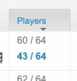

# BF3 Battlelog Real Players

Displays accurate player count in Battlefield 3 battlelog server list.

Chrome Extension available [here](https://chromewebstore.google.com/detail/bf3-battlelog-player-coun/pbciggcfhkkglkfibebcigojfkefkdkk)

## Description

A Chrome extension that displays the real player count on a server instead of the fake/spoofed player count. Servers in the server browser will now display a blue player count under the spoofed count. 

Demo: https://youtu.be/zcVbXtkwvwU?si=7hgNtCOaIztKKtyJ

Server owners should not be putting fake players in the game in order for people to join. With this extension, you can now see which servers are empty, and which are full of players.

## Version History

* 0.0.1
    * Initial Release

